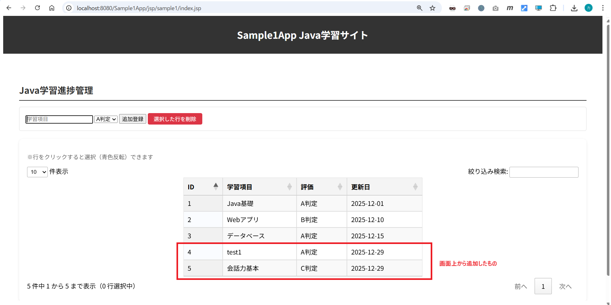
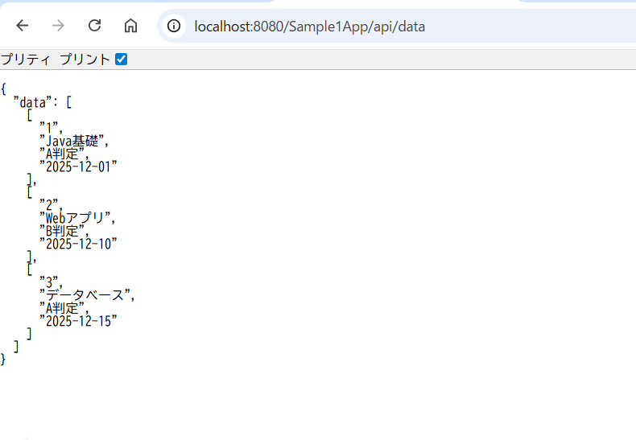
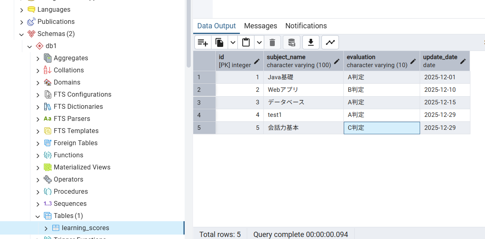
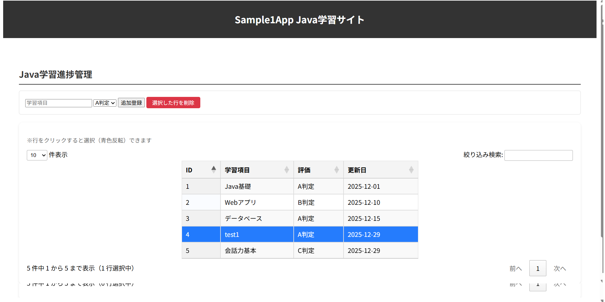
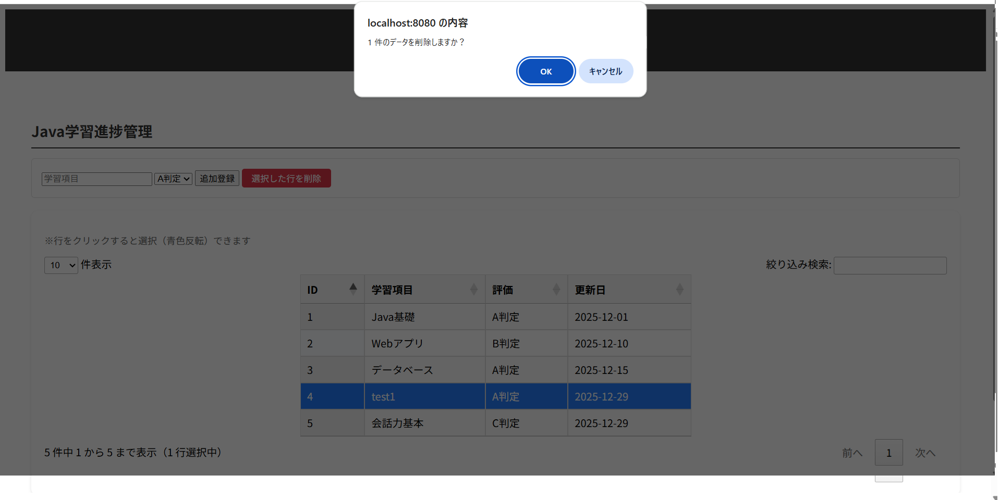
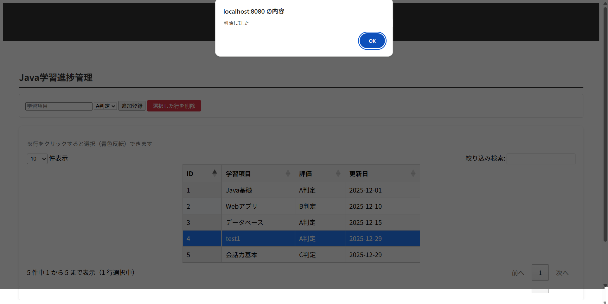
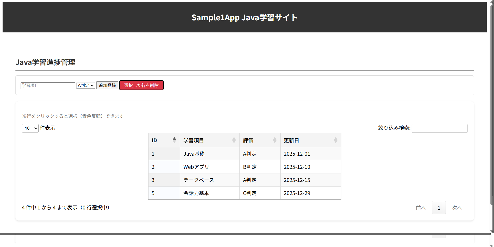
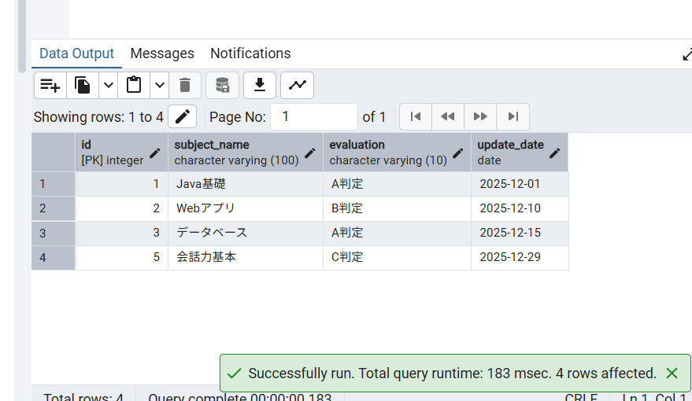

# サーブレットの復習
> ノンフレームワークで生のDBデータをWEBページにレンダリングまで。

## ①　初期表示について
http://localhost:8080/Sample1App/jsp/sample1/index.jsp
> 初期表示について、JqueryのDataTablesライブラリのものを使って、DB結果をセットしています。
> 追加機能として、入力事項に対して、DataTablesに登録とマスタに反映ができます。

### JSPの値:
API_URL = "${pageContext.request.contextPath}/api/data";

## ② API結果の確認
http://localhost:8080/Sample1App/api/data
> DBから取得したものになります。

## ③ マスタへの反映確認

## ④ 削除するものを選択して「選択した行を削除」をクリックする。  

  
  
  

## ⑤ 削除したあとの画面とマスタの確認  

  
  